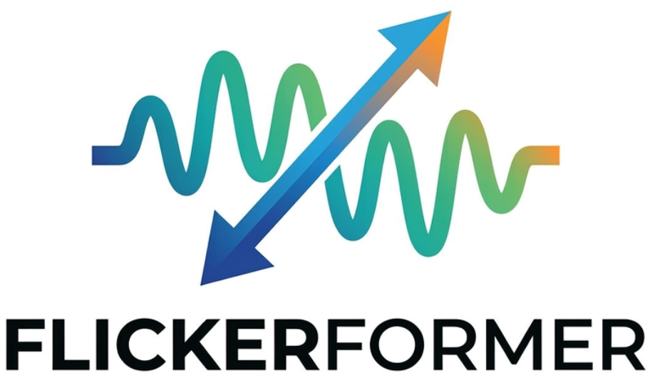
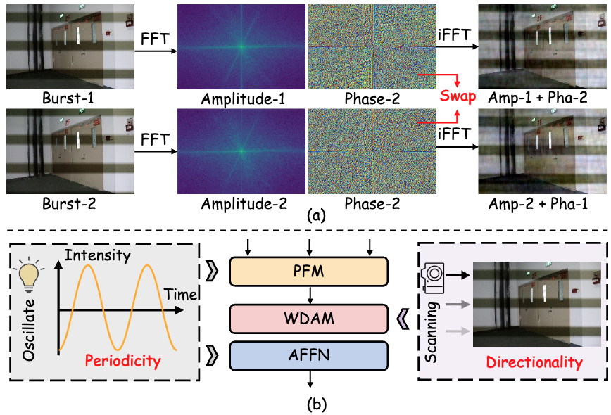
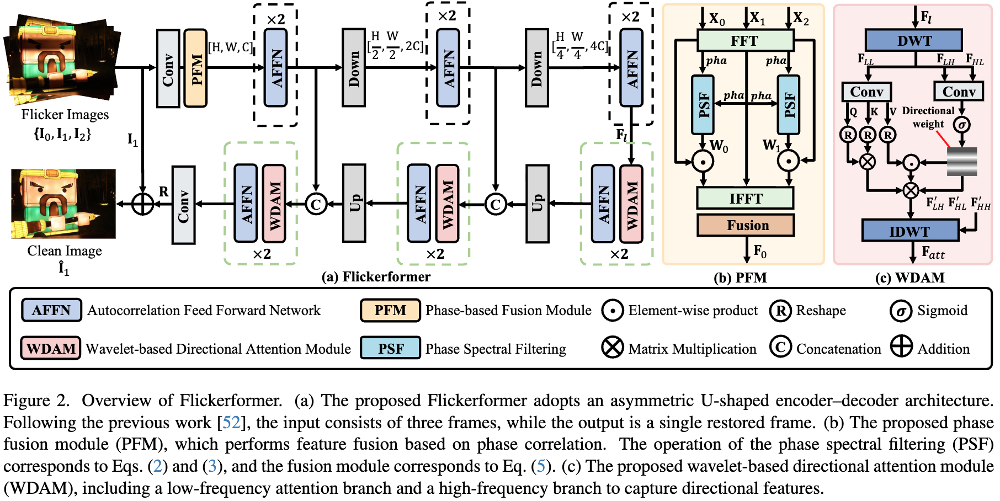
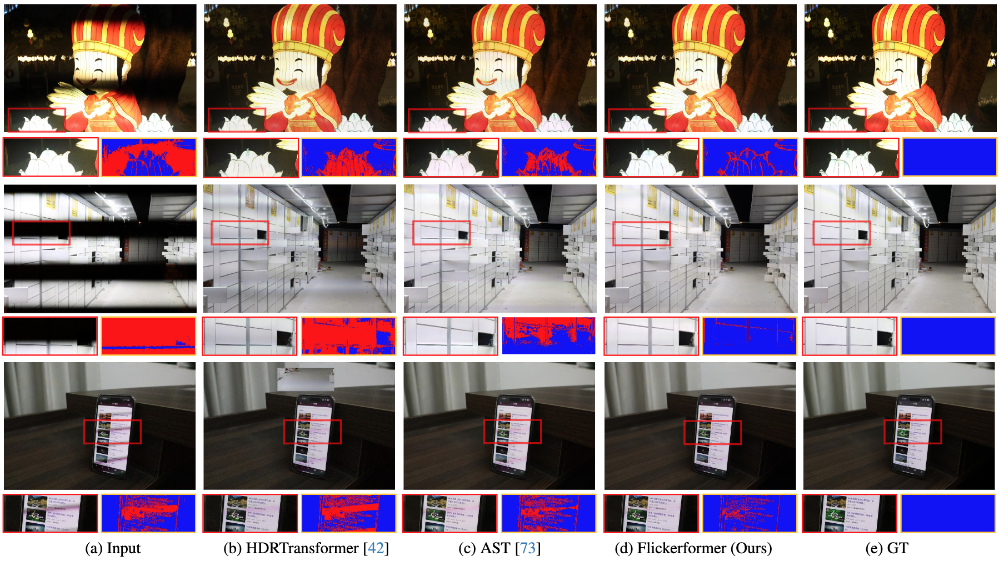

<div align="center">



# ✨ It Takes Two: A Duet of Periodicity and Directionality for Burst Flicker Removal

[](#citation) [](#introduction) [](https://qulishen.github.io/project/Flickerformer.html)

<!-- [](#flickerformer-architecture)
[](https://www.kaggle.com/datasets/lishenqu/burstflicker) -->

</div>

## 🧭 Overview

Quick links: [Motivation](#motivation) | [Architecture](#flickerformer-architecture) | [Results](#qualitative-results) | [Training](#training) | [Citation](#citation)

## 📖 Introduction

Flicker artifacts are caused by unstable illumination and row-wise exposure under the rolling-shutter mechanism, leading to structured spatial-temporal degradation.
Unlike common degradations such as noise or low-light, flicker exhibits two intrinsic properties: **periodicity** and **directionality**.  
Flickerformer is a transformer-based framework for burst flicker removal, built on three key components:

- **PFM (Phase-based Fusion Module)**: adaptively fuses burst features via inter-frame phase correlation;
- **AFFN (Autocorrelation Feed-Forward Network)**: captures intra-frame periodic structures through autocorrelation;
- **WDAM (Wavelet-based Directional Attention Module)**: uses directional high-frequency wavelet cues to guide low-frequency dark-region restoration.

The model suppresses flicker effectively while reducing ghosting artifacts, and achieves superior quantitative and visual performance compared with prior methods.

## 💡 Motivation

Flicker is not random noise. It is a structured degradation with explicit physical priors.
As shown below, phase information is strongly related to flicker spatial distribution, and the rolling-shutter mechanism introduces directional stripe patterns.



## 🧠 Flickerformer Architecture

Flickerformer adopts a U-shaped encoder-decoder design and explicitly embeds periodicity and directionality priors:

- **PFM + AFFN**: periodicity-aware modeling in the frequency domain (inter-frame and intra-frame);
- **WDAM**: directionality-aware modeling in the spatial-wavelet domain (high-frequency guidance for low-frequency restoration).



## 🖼️ Qualitative Results

Across diverse flicker scenarios, Flickerformer localizes affected regions more precisely, restores illumination consistency, and preserves texture and color fidelity.



## ⚙️ Installation

1. Install dependencies

```bash
cd Flickerformer
pip install -r requirements.txt
```

2. Install `basicsr` in the project root

```bash
python setup.py develop
```

## 📦 Dataset

BurstDeflicker: [Kaggle Link](https://www.kaggle.com/datasets/lishenqu/burstflicker)

Recommended dataset structure:

```bash
dataset/
├── BurstFlicker-G
│   ├── train
│   │   ├── input
│   │   └── gt
│   └── test
└── BurstFlicker-S
    ├── train
    │   ├── input
    │   │   ├── 0001
    │   │   │   ├── 0001.png
    │   │   │   ├── 0002.png
    │   │   │   └── ...
    │   │   └── ...
    │   └── gt
    │       ├── 0001
    │       └── ...
    └── test
```

To convert mp4 videos into frames:

```bash
cd dataset
python cut.py
```

## 🚀 Training

```bash
bash ./dist_train.sh 2 options/Flickerformer.yml
```

## ✅ Testing and Evaluation

```bash
python test.py --input dataset/BurstFlicker-S/test-resize/input --output result/flickerformer --model_path Flickerformer.pth
```

```bash
python evaluate.py --input result/
```

## 📚 Citation

If you find this project useful, please cite:

```bibtex
@inproceedings{qu2026flickerformer,
  title={It Takes Two: A Duet of Periodicity and Directionality for Burst Flicker Removal},
  author={Lishen, Qu and Shihao, Zhou and Jie, Liang and Hui, Zeng and Lei, Zhang and Jufeng, Yang},
  booktitle={Proceedings of the IEEE/CVF Conference on Computer Vision and Pattern Recognition},
  year={2026}
}
```
